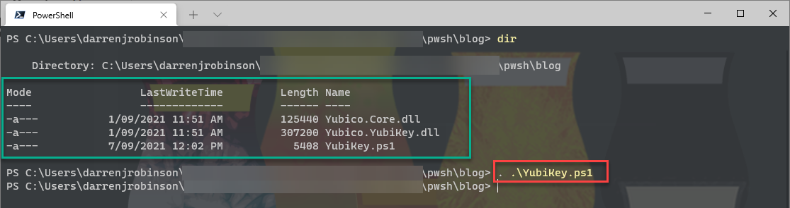
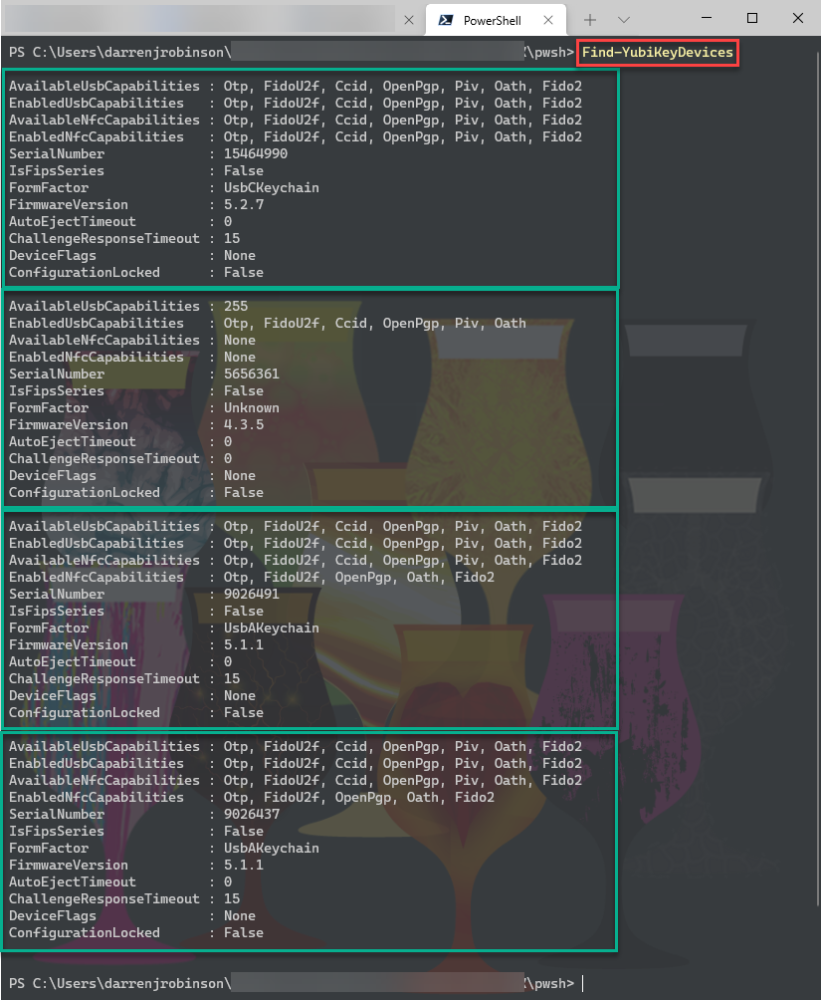
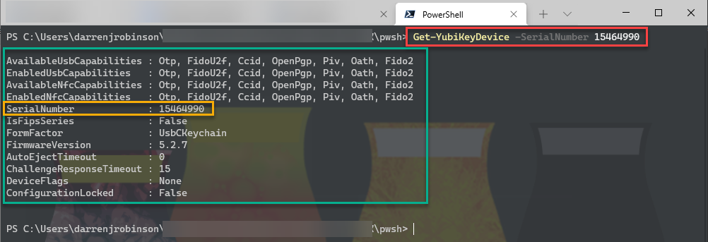
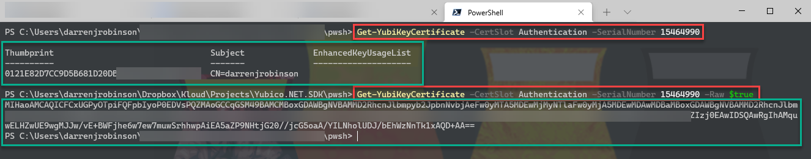

# Discover Yubico YubiKeys. Get certificates from YubiKey Certficate Slots

## Description

PowerShell functions to discover Yubico YubiKeys and obtain certificates from certificate slots.

Utilises the [Yubico desktop .NET SDK](https://github.com/Yubico/Yubico.NET.SDK)

Contains v4.0.30319 of the compiled libraries.

[Associated Blogpost](https://blog.darrenjrobinson.com/get-certificates-from-a-yubikey-using-powershell)

## Features

- Works with PowerShell (6.x, 7.x). *Not compatibile with Windows PowerShell (e.g v5.1)*
- Discovers connected Yubico keys independant of which transport they are connected via
- Returns general YubiKey device information
- Read certificates from the slots 9a - 'Authentication' 9c - 'Signature' 9d - 'Key Management' 9e - 'Card Authentication'
- SDK returns certificates as binary so this module will convert and decode the certificate and return it as a X509Certificate2 object
- Optional parameter (RAW) to return the certificate as a Base64 string

## Dependencies

- PowerShell Core or PowerShell 7+

## Installation

Download from this Repo and keep the DLLs and the YubiKey.ps1 script in the same directory. Import the functions by running the YubiKey.ps1 with a dot prefix. 

```powershell
. .\YubiKey.ps1
```


## How to use

### Discover connected Yubico YubiKey Devices

```powershell
. .\YubiKey.ps1
Find-YubiKeyDevices 
```



### Return device information for a specific connected Yubico YubiKey

*SerialNumber can be obtained using Find-YubiKeyDevices*

```powershell
Get-YubiKeyDevice -SerialNumber 12345
```



### Find and return a specific certificate from a Yubico YubiKey

PARAMETER CertSlot

Certificate Slot to return the certificate from

- Slot 9a 'Authentication'
- Slot 9c 'Signature'
- Slot 9d 'KeyManagement'
- Slot 9e 'CardAuthentication'


PARAMETER SerialNumber

SerialNumber of the YubiKey

Can be found using Find-YubiKeyDevices


PARAMETER Raw

Return the base64 encoded certficate rather than decoding and returning it as a Certficate object.

Defaults to $False

```powershell
Get-YubiKeyCertificate -CertSlot Authentication -SerialNumber 15464990 
```

```powershell
Get-YubiKeyCertificate -CertSlot Signature -SerialNumber 15464990 
```

```powershell
Get-YubiKeyCertificate -CertSlot KeyManagement -SerialNumber 15464990 
```

```powershell
Get-YubiKeyCertificate -CertSlot CardAuthentication -SerialNumber 15464990 
```

```powershell
Get-YubiKeyCertificate -CertSlot CardAuthentication -SerialNumber 15464990 -Raw $True
```

## Example Output



## Keep up to date

* [Associated Blogpost](https://blog.darrenjrobinson.com/get-certificates-from-a-yubikey-using-powershell)
* [Visit my blog](https://blog.darrenjrobinson.com)
* [Follow darrenjrobinson](https://twitter.com/darrenjrobinson)
